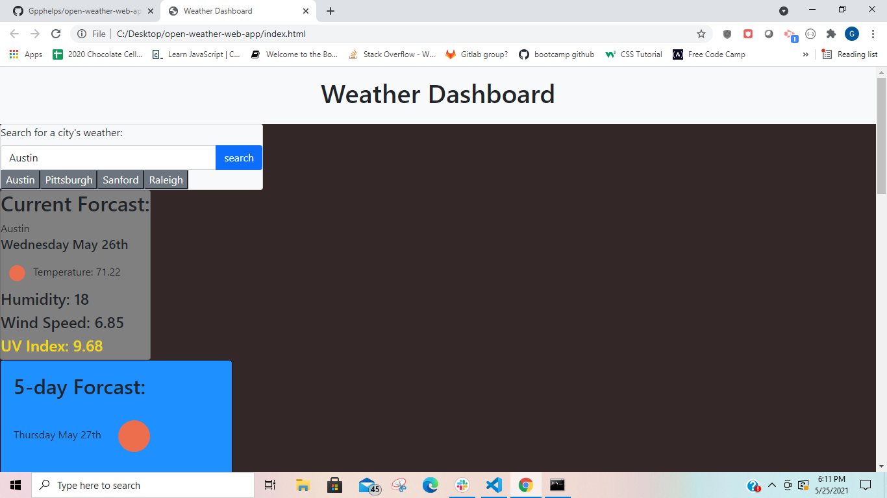

# open-weather-web-app

## Description

The Open Weather API Dashboard is a single stop website to deteermine the weather for any number of citites for today's weather and the future five day forcast. This is useful not only for camping, but aslo any travel plans where weather could impact your trip. It is low impact on your devide and can work with the slowest internet service.

## Usage

To use the Open Weather Dashboard type in the city that you would like to know the weather for and click the search button. The current and five day weather forcast for that city will then be displayed for you. That process can be repeated for any number of cities that you wish to search. To view the weather for a city that you have already searched simply click the button with the city name you would like to view and the current and five day weather forcast will be displayed.

## Installation 

Installation: There is no instillation for this program as it is a singular webpage. If you would like to access the website visit: 
https://gpphelps.github.io/open-weather-web-app/ 

## Contributing 

If you would like to contribute in any way to this project please feel free to post an issue to the Github repository and I will address it as quickly as possible.

## Features

The Open Weather API Dashboard makes uses of moment.js to display the date for the cities weather. 
The Open Weather API is called to in order to get the weather data displayed to the user. The first API call is used to get the Lat and Long of the desiered city and then the secodn API call is the oen that actually displays the weather data. This is because the UV Index  API call is being depricated by Open Weather and would not be viable long term for this project.
jQuery is used to dynamicly create html elements when needed.
Local storage is employed to save the citites that have been viewed by the user so that the data can be used by the previous search buttons to display weather data of previously seach cities to the user.

## License

MIT
